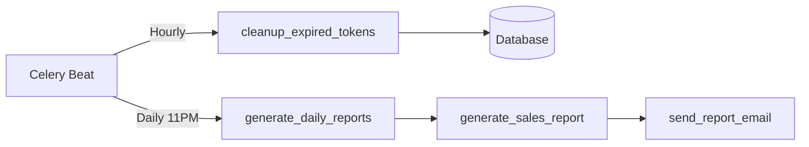

# Phase 18.4 Complete: Scheduled Tasks & Monitoring

## ✅ Implementation Summary

Successfully implemented scheduled maintenance tasks and comprehensive monitoring endpoints.

## Components Implemented

### 1. Scheduled Maintenance Tasks
**File**: `backend/app/infrastructure/tasks/scheduled_tasks.py`

#### Token Cleanup Task
- **Task**: `cleanup_expired_tokens()`
- **Schedule**: Hourly (via Celery Beat)
- **Purpose**: Remove expired refresh tokens from database
- **Returns**: Count of deleted tokens

#### Import Job Cleanup Task
- **Task**: `cleanup_old_import_jobs(days_old)`
- **Schedule**: Manual/configurable
- **Purpose**: Archive old completed/failed import jobs
- **Default**: Delete jobs older than 30 days

#### Daily Report Generation
- **Task**: `generate_daily_reports()`
- **Schedule**: Daily at 11 PM (via Celery Beat)
- **Purpose**: Auto-generate and email yesterday's sales reports
- **Features**: Chainable with email delivery

#### Health Check Tasks
- **Task**: `health_check_celery()`
- **Purpose**: Verify Celery workers are responding
- **Task**: `database_health_check()`
- **Purpose**: Test database connectivity

### 2. Monitoring API Router
**File**: `backend/app/api/routers/monitoring_router.py`

#### Public Health Check
**GET /api/v1/monitoring/health**
- No authentication required
- Used by load balancers/k8s probes
- Returns: `{status, timestamp, service}`

#### Detailed Health Check
**GET /api/v1/monitoring/health/detailed**
- Requires MANAGEMENT_ROLES
- Checks: API, Celery workers, Database
- Returns: Component-level status

#### Celery Workers Status
**GET /api/v1/monitoring/celery/workers**
- List active Celery workers
- Shows active tasks per worker
- Worker statistics

#### Celery Queue Status
**GET /api/v1/monitoring/celery/queues**
- Pending/active task counts per queue
- Monitors: imports, reports, emails, default queues

#### Task Information
**GET /api/v1/monitoring/celery/tasks/{task_id}**
- Detailed task state
- Result/error/traceback information

#### Manual Cleanup Triggers
**POST /api/v1/monitoring/maintenance/cleanup-tokens**
- Manually trigger token cleanup

**POST /api/v1/monitoring/maintenance/cleanup-imports**
- Manually trigger import job cleanup
- Query param: `days_old` (default: 30)

## Celery Beat Schedule Configuration

Already configured in `celery_app.py`:

```python
celery_app.conf.beat_schedule = {
    "cleanup-expired-tokens-hourly": {
        "task": "cleanup_expired_tokens",
        "schedule": 3600.0,  # Every hour
    },
    "generate-daily-reports": {
        "task": "generate_daily_reports",
        "schedule": crontab(hour=23, minute=0),  # 11 PM daily
    },
}
```

## Usage Examples

### 1. Health Checks

#### Basic Health (Public)
```bash
curl http://localhost:8000/api/v1/monitoring/health
```

**Response**:
```json
{
  "status": "healthy",
  "timestamp": "2024-01-15T10:30:00Z",
  "service": "retail-pos-api"
}
```

#### Detailed Health (Authenticated)
```bash
curl http://localhost:8000/api/v1/monitoring/health/detailed \
  -H "Authorization: Bearer $TOKEN"
```

**Response**:
```json
{
  "status": "healthy",
  "timestamp": "2024-01-15T10:30:00Z",
  "components": {
    "api": {"status": "healthy"},
    "celery": {
      "status": "healthy",
      "details": {"timestamp": "..."}
    },
    "database": {
      "status": "healthy",
      "connected": true
    }
  }
}
```

### 2. Monitor Celery Workers
```bash
curl http://localhost:8000/api/v1/monitoring/celery/workers \
  -H "Authorization: Bearer $TOKEN"
```

**Response**:
```json
{
  "status": "active",
  "workers": [
    {
      "name": "celery@hostname",
      "active_tasks": 2,
      "stats": {...}
    }
  ],
  "count": 1,
  "timestamp": "2024-01-15T10:30:00Z"
}
```

### 3. Check Queue Status
```bash
curl http://localhost:8000/api/v1/monitoring/celery/queues \
  -H "Authorization: Bearer $TOKEN"
```

**Response**:
```json
{
  "queues": {
    "imports": {"pending": 3, "active": 1},
    "reports": {"pending": 0, "active": 0},
    "emails": {"pending": 1, "active": 0},
    "default": {"pending": 0, "active": 0}
  },
  "timestamp": "2024-01-15T10:30:00Z"
}
```

### 4. Manual Cleanup
```bash
# Cleanup expired tokens
curl -X POST http://localhost:8000/api/v1/monitoring/maintenance/cleanup-tokens \
  -H "Authorization: Bearer $TOKEN"

# Cleanup old import jobs (90 days)
curl -X POST "http://localhost:8000/api/v1/monitoring/maintenance/cleanup-imports?days_old=90" \
  -H "Authorization: Bearer $TOKEN"
```

## Monitoring Architecture

### Component Health Checks

```mermaid
graph TD
    LB[Load Balancer] --> |GET /health| API[FastAPI]
    API --> DB[Database]
    API --> Celery[Celery Workers]
    Celery --> Redis[Redis Broker]
    
    Monitor[/monitoring/health/detailed] --> API
    Monitor --> DB
    Monitor --> Celery
```

### Scheduled Tasks Flow



## Kubernetes Integration

### Liveness Probe
```yaml
livenessProbe:
  httpGet:
    path: /api/v1/monitoring/health
    port: 8000
  initialDelaySeconds: 30
  periodSeconds: 10
```

### Readiness Probe
```yaml
readinessProbe:
  httpGet:
    path: /api/v1/monitoring/health/detailed
    port: 8000
  initialDelaySeconds: 10
  periodSeconds: 5
```

## Observability Integration

### Prometheus Metrics (Future Phase 20)

Endpoints ready for metric export:
- `/monitoring/celery/queues` → Queue depth metrics
- `/monitoring/celery/workers` → Worker count metrics
- `/monitoring/health/detailed` → Component health metrics

### Grafana Dashboards (Future Phase 20)

Ready for visualization:
- Task completion rates
- Queue wait times
- Worker utilization
- Failed task counts

## Alerting Rules

### Recommended Alerts

1. **Celery Workers Down**
   - Condition: No active workers for > 5 minutes
   - Endpoint: `/monitoring/celery/workers`

2. **Database Unreachable**
   - Condition: `/health/detailed` shows DB unhealthy
   - Action: Page on-call engineer

3. **Queue Backlog**
   - Condition: Queue depth > 100 for > 10 minutes
   - Endpoint: `/monitoring/celery/queues`

4. **Failed Tasks High**
   - Condition: >10% task failure rate
   - Monitor: Flower UI or custom metrics

## Running the System

### Start All Services
```bash
# Full stack with monitoring
docker-compose -f docker-compose.dev.yml up -d

# Services: postgres, redis, celery-worker, celery-beat, flower, backend
```

### Verify Scheduled Tasks
```bash
# Check Celery Beat is running
docker-compose -f docker-compose.dev.yml logs celery-beat

# Should see:
# "celery beat v5.x starting..."
# "beat: Sending due task cleanup-expired-tokens-hourly"
```

### Monitor Task Execution
```bash
# Watch worker logs
docker-compose -f docker-compose.dev.yml logs celery-worker -f

# Should see scheduled tasks executing:
# "Task cleanup_expired_tokens succeeded"
```

### Access Flower UI
- URL: http://localhost:5555
- View: Tasks → Scheduled
- Check: Beat schedule and execution history

## Testing

### 1. Test Health Checks
```bash
# Test basic health
curl http://localhost:8000/api/v1/monitoring/health

# Test detailed health (need admin token)
export TOKEN=$(curl -X POST http://localhost:8000/api/v1/auth/login \
  -H "Content-Type: application/json" \
  -d '{"username":"admin","password":"admin"}' | jq -r '.access_token')

curl http://localhost:8000/api/v1/monitoring/health/detailed \
  -H "Authorization: Bearer $TOKEN"
```

### 2. Test Scheduled Tasks
```python
# scripts/test_scheduled_tasks.py
from app.infrastructure.tasks.scheduled_tasks import (
    cleanup_expired_tokens,
    cleanup_old_import_jobs,
    health_check_celery,
)

# Manual execution
task1 = cleanup_expired_tokens.apply_async()
print(f"Cleanup task: {task1.id}")

task2 = health_check_celery.apply_async()
result = task2.get(timeout=5)
print(f"Health check: {result}")
```

### 3. Test Monitoring Endpoints
```bash
# Check worker status
curl http://localhost:8000/api/v1/monitoring/celery/workers \
  -H "Authorization: Bearer $TOKEN" | jq

# Check queue status
curl http://localhost:8000/api/v1/monitoring/celery/queues \
  -H "Authorization: Bearer $TOKEN" | jq

# Trigger manual cleanup
curl -X POST http://localhost:8000/api/v1/monitoring/maintenance/cleanup-tokens \
  -H "Authorization: Bearer $TOKEN"
```

## Configuration

### Celery Beat Service

Already configured in `docker-compose.dev.yml`:

```yaml
celery-beat:
  build: ./backend
  command: celery -A app.infrastructure.tasks.celery_app beat -l info
  depends_on:
    - redis
  volumes:
    - ./backend:/app
  environment:
    - DATABASE_URL=${DATABASE_URL}
```

### Schedule Customization

Edit `backend/app/infrastructure/tasks/celery_app.py`:

```python
celery_app.conf.beat_schedule = {
    "cleanup-expired-tokens-hourly": {
        "task": "cleanup_expired_tokens",
        "schedule": 3600.0,  # Adjust frequency
    },
    "cleanup-old-imports-weekly": {
        "task": "cleanup_old_import_jobs",
        "schedule": crontab(day_of_week=0, hour=2),  # Sunday 2 AM
        "args": [90],  # 90 days old
    },
}
```

## Maintenance Operations

### Manual Task Execution

Via Python:
```python
from app.infrastructure.tasks.scheduled_tasks import cleanup_old_import_jobs

# Delete jobs older than 60 days
task = cleanup_old_import_jobs.apply_async(args=[60])
result = task.get()
print(f"Deleted {result['deleted_count']} jobs")
```

Via API:
```bash
curl -X POST "http://localhost:8000/api/v1/monitoring/maintenance/cleanup-imports?days_old=60" \
  -H "Authorization: Bearer $TOKEN"
```

## Next Steps

✅ **Phase 18 Complete** - Async Job Processing (4/4 sub-phases)

**Next**: Phase 11 - Real-Time Communication
- WebSocket connection manager
- Server-sent events
- Real-time notifications
- Live dashboard updates

## Files Changed

### Phase 18.4 Files
1. ✅ `backend/app/infrastructure/tasks/scheduled_tasks.py` - Scheduled tasks
2. ✅ `backend/app/api/routers/monitoring_router.py` - Monitoring API
3. ✅ `backend/app/api/main.py` - Router registration
4. ✅ `backend/app/api/routers/__init__.py` - Router exports

### Complete Phase 18 Summary

#### Infrastructure (18.1)
- Celery app configuration
- Redis services
- Task queues (imports, reports, emails)
- Celery Beat scheduler
- Flower monitoring

#### Product Import (18.2)
- Enhanced ImportScheduler protocol
- CeleryImportScheduler adapter
- Async product import task
- Task tracking API endpoints

#### Reports & Email (18.3)
- Sales/inventory report generation
- Email notification system
- Report email templates
- SMTP configuration

#### Scheduled Tasks & Monitoring (18.4)
- Token cleanup (hourly)
- Import job cleanup
- Daily report generation
- Health check endpoints
- Worker/queue monitoring

## Documentation

- Master roadmap: `docs/implementation-roadmap.md`
- Phase 18 guide: `docs/phase18-async-jobs.md`
- Phase 18.1: `docs/QUICKSTART-PHASE18.md`
- Phase 18.2: `docs/phase18-2-complete.md`
- Phase 18.3: `docs/phase18-3-complete.md`
- This summary: `docs/phase18-4-complete.md`

---

🎉 **Phase 18: Async Job Processing - COMPLETE**

All async infrastructure, task processing, reporting, email, scheduling, and monitoring capabilities are now operational!
